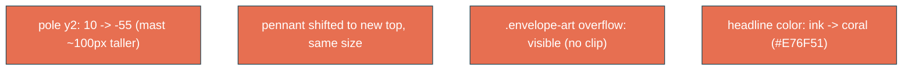

# taller-flag-coral

## Verbatim request (2026-06-15)

> can we make the flag on the boat roughly 100px taller? and can we make the "You are
> invited to" text a red coral like the bottom button?
> [confirmed: taller mast (flag flies higher), pennant same size; headline =
> var(--yait-coral), keep the sand shadow]

## Confirmed understanding

1. Make the boat's flag roughly 100px taller by extending the mast upward (the pennant
   flies higher), keeping the pennant the same size. The envelope-art svg must overflow
   so the taller mast is not clipped by its `viewBox`.
2. Colour the headline "You Are / Invited To" the same coral as the bottom CTA button
   (`var(--yait-coral)`, #E76F51), keeping the existing sand drop-shadow.

## Mechanism

- Flag (`envelope-art`, viewBox 0 0 200 140, rendered ~1.5x): the art renders ~1.535px
  per unit at desktop, so ~100px is ~65 units. Pole `y2: 10 -> -55`; pennant shifted to
  the new top (`M32 10 L2 18 L32 26 Z -> M32 -55 L2 -47 L32 -39 Z`). `.envelope-art`
  gets `overflow: visible` so the mast above the viewBox top shows.
- Headline: `.headline color: var(--yait-ink) -> var(--yait-coral)`; `text-shadow`
  unchanged.

## Out of scope

The flag direction (still left), the envelope body/flap, the boat motion, the wake, the
headline reveal/size. Only the mast height (+ art overflow) and the headline colour change.

## Validation

To validate taller-flag-coral I can integration-assert the new pole `y2="-55"` and pennant
path (old gone); canary that `.headline` is `var(--yait-coral)` and `.envelope-art` is
`overflow: visible`; e2e that the headline computed colour is `rgb(231, 111, 81)`.
Screenshot the boat (flag flies higher, not clipped) and the headline (coral).
