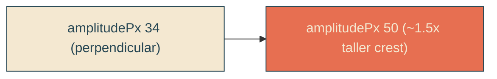

# taller-wave-amplitude

## Verbatim request (2026-06-13)

> can we have the amplitude increased of the waves?

## Confirmed understanding

Make the whip bump taller: `WHIP_GEOMETRY.amplitudePx` 34 -> 50 (~1.5x). The bump
swells higher off the slant (a more pronounced single crest). Everything else is
unchanged: the sin-taper shape, full end-to-end travel, cadence, single edge,
durations, geometry (still 45 degrees, 370px slant).

## Notes

- No fold risk: the along-slant tangent component is always the edge length
  regardless of the perpendicular offset, so the curve always advances; only the
  perpendicular bulge grows. The clip enclosure (+/- 0.5 box) easily contains a 50px
  bulge on a 370px box.
- The sin taper still zeroes the offset at both slant ends, so the ends stay flat at
  any amplitude.

## Validation

To validate taller-wave-amplitude I can capture the reveal and confirm the bump
crest is visibly taller than before while still a single clean swell; the unit test
asserts the new amplitude and a one-lobe bump of ~50px.

## Out of scope

Cadence, shape envelope, travel, single-edge structure, durations - unchanged.
