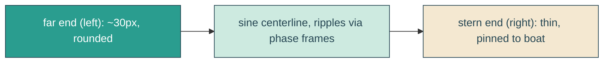

# tapered-wake

## Verbatim request (2026-06-15)

> can we have that line be progressively thicker as it moves away from the boat? like by
> the end it's 30px thick? with rounded corners?
> [confirmed: filled tapered ribbon, thin at stern -> ~30px at the far end, rounded ends,
> keep the wiggle, white 45%]

## Why a rebuild

An SVG stroke has one uniform width and cannot taper. So the wake stops being a stroked
line and becomes a filled ribbon whose thickness varies along its length: thin where it
meets the boat's stern, growing to ~30px at the far (trailing) end, with rounded ends.

## Mechanism

- New pure generator `buildWakeRibbon(geometry, phase)` in `heroScene.ts`: a gentle sine
  centerline across the wake width; a half-thickness that grows from `minHalf` (stern,
  right) to `maxHalf` (far, left); top edge out, a semicircular cap at the far end, bottom
  edge back, a small cap at the stern, closed. `WAKE_FRAMES` are phase-shifted frames so
  it ripples (morph).
- `HeroBay.astro`: the `.reveal-echo` svg renders one `<path class="reveal-echo-line">`
  fed by `WAKE_FRAMES`, with `<animate attributeName="d">` cycling the frames. The svg has
  a pixel-proportioned `viewBox` (no non-uniform stretch) so thickness is predictable. It
  stays a child of `.envelope-track`, pinned at the stern, so it still rides the boat.
- `yait.css`: `.reveal-echo-line` becomes a fill (`fill: #fff; fill-opacity: 0.45`) instead
  of a stroke; `.reveal-echo` is sized in px to match the ribbon's viewBox and anchored so
  its thin (stern) end sits at the boat's back edge at the waterline.

## Out of scope

The boat, headline, reveal clip, clouds. The wake stays white 45%, stern-pinned, and
rides the sail; only its geometry (stroked line -> tapered filled ribbon) and fill change.

## Validation

To validate tapered-wake I can unit-test `buildWakeRibbon` (closed path, arc caps,
deterministic, frame count); canary that `.reveal-echo-line` is a fill not a stroke; and
e2e that the wake's rendered height is meaningfully larger at the far end (~30px) than
before, still pinned at the stern with no scroll. Screenshot the hero mid-sail and confirm
the wake widens away from the boat with rounded ends; tune `maxHalf`/anchor by screenshot.
