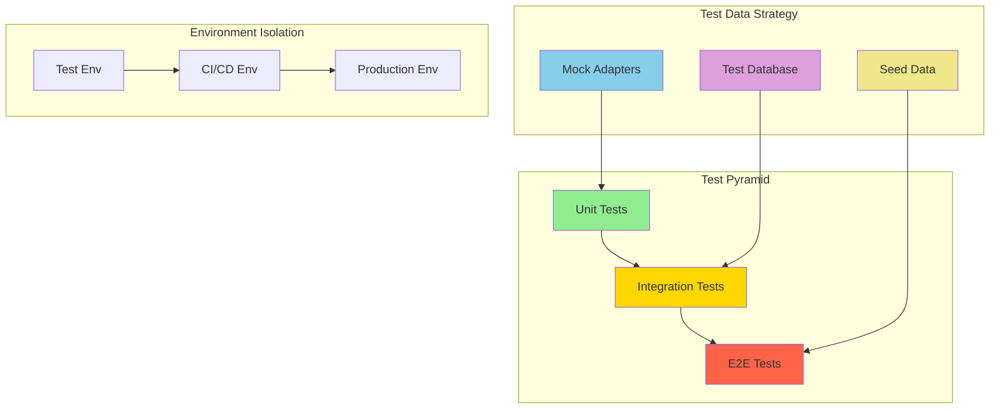

# Test Stability Fix

## Problem Statement

The test suite has significant stability issues with 52/136 tests failing across multiple categories. This impacts development confidence, CI/CD reliability, and code quality assurance.

## Current Test Status Analysis

### Feature Flag Tests: 91% Pass Rate (69/76)
- **Status**: Mostly successful
- **Issue**: 7 legacy tests failing due to architectural change
- **Action**: Remove or update legacy tests to match new interface-based system

### Database-Dependent Tests: 0% Pass Rate
- **Status**: Complete failure
- **Root Cause**: PostgreSQL connection refused (127.0.0.1:5432)
- **Issues**: Photo selection, game integration, admin components
- **Action**: Implement proper test database setup or mocking strategy

### E2E Browser Tests: 25% Pass Rate (15/60)
- **Status**: Critical issues
- **Root Causes**: 
  - Viewport positioning problems (disco ball element outside viewport)
  - Content mismatches (dates, text not matching expectations)
  - Form submission flows broken
  - Missing design elements
- **Action**: Fix UI positioning, content generation, and form handling

### Admin/UI Component Tests: Mixed Results
- **Status**: Partial failures
- **Root Causes**: Database dependencies, DOM structure mismatches
- **Action**: Improve component isolation and mocking

## Engineering Goals

1. **Stability**: Achieve 95%+ test pass rate
2. **Reliability**: Tests pass consistently across environments
3. **Maintainability**: Clear separation between unit, integration, and e2e tests
4. **Performance**: Fast test execution with proper test data management
5. **Coverage**: Comprehensive testing without redundancy

## Test Architecture Principles

## Root Cause Categories

### 1. Environment Setup Issues
- Database not running in test environment
- Missing environment variables
- Port conflicts

### 2. Test Design Issues
- Tight coupling to external systems
- Insufficient mocking strategies
- Brittle selectors and assertions

### 3. Code Changes Without Test Updates
- Feature flag architecture changed but legacy tests remain
- Content/UI changes without corresponding test updates
- API changes without test contract updates

### 4. Infrastructure Issues
- Viewport/browser environment configuration
- Test data management
- Async timing issues

## Success Criteria

- [ ] All feature flag tests pass (100%)
- [ ] Database-dependent tests use proper test database or mocks
- [ ] E2E tests reliably pass in headless and headed modes
- [ ] Test execution time under 2 minutes for full suite
- [ ] Clear test categorization and documentation
- [ ] CI/CD integration with proper test environment setup