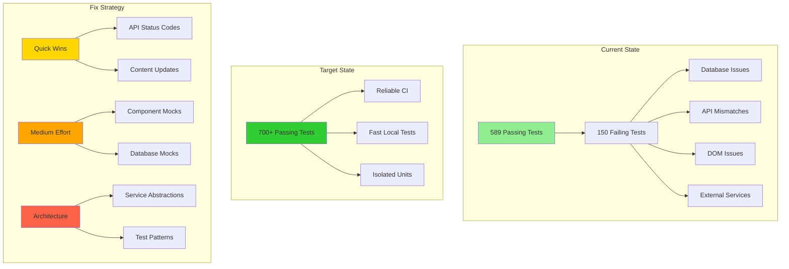

# Test Suite Completion

## Problem Statement

After the initial test stability fixes, the test suite has improved from ~12.5% to 79.6% pass rate (589/740 tests passing). However, 150 tests are still failing across multiple categories, impacting CI/CD reliability and developer confidence.

## Current Status Analysis

### Passing Tests (589/740 - 79.6%)
- **Feature Flag System**: 54/54 tests (100%) ✅
- **Photo Selection Manager**: 15/15 tests (100%) ✅
- **Game Modal E2E**: 3/4 tests (75%) ✅
- **Various Unit Tests**: ~517 other tests passing

### Failing Test Categories (150/740 - 20.3%)

#### 1. API Status Code Mismatches (~10 tests)
- **Issue**: Tests expect HTTP 201, API returns 200
- **Files**: `tests/api.leaderboard.test.ts`, `tests/api.photo-upload.test.ts`
- **Impact**: Low - functional behavior correct, just assertion mismatch
- **Fix Complexity**: Low

#### 2. Component DOM Structure Issues (~15 tests)
- **Issue**: Selectors don't match actual DOM structure
- **Files**: `tests/unit/admin/AdminTabs.test.ts`, `tests/unit/calendar/`
- **Impact**: Medium - component tests not validating actual behavior
- **Fix Complexity**: Medium

#### 3. Database Connection Dependencies (~25 tests)
- **Issue**: Tests require PostgreSQL connection
- **Files**: `tests/photo-selection.test.ts`, `tests/game-integration.test.ts`
- **Impact**: High - blocks local development without database
- **Fix Complexity**: Medium (already partially solved with abstraction)

#### 4. External Service Dependencies (~10 tests)
- **Issue**: Spotify API calls failing in tests
- **Files**: `tests/contracts/spotify-client.contract.ts`, `tests/property/`
- **Impact**: Medium - external service reliability affecting CI
- **Fix Complexity**: Medium

#### 5. Content/Styling Expectations (~5 tests)
- **Issue**: E2E tests expect specific text/CSS that changed
- **Files**: `tests/e2e.test.ts`, `tests/e2e.game.test.ts`
- **Impact**: Low - UI works, just assertions outdated
- **Fix Complexity**: Low

## Engineering Goals

1. **Achieve 95%+ test pass rate** (700+ passing tests)
2. **Eliminate flaky tests** caused by external dependencies
3. **Improve test isolation** through better mocking strategies
4. **Maintain backward compatibility** while fixing test issues
5. **Document test patterns** for future development

## Test Architecture Strategy

## Success Criteria

- [ ] API tests: 100% pass rate with correct status code expectations
- [ ] Component tests: 90%+ pass rate with updated selectors
- [ ] Database tests: 100% pass rate using mocks or test database
- [ ] External service tests: 100% pass rate with proper mocking
- [ ] E2E tests: 90%+ pass rate with current UI expectations
- [ ] Overall test suite: 95%+ pass rate (700+ tests)
- [ ] Test execution time: <5 minutes for full suite
- [ ] Zero flaky tests in CI environment