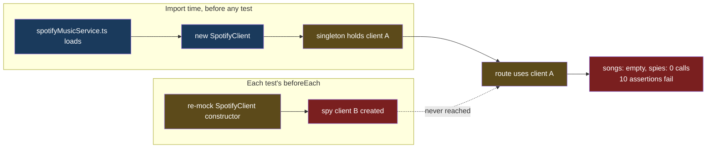
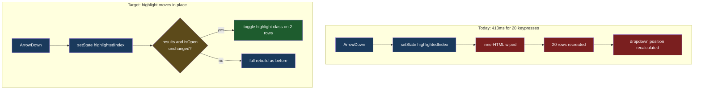

# Test Suite Stabilization — Diagrams

## Why ten integration tests fail at once: the singleton mock gap

Fix: test the route against a mocked `spotifyMusicService` module (its real dependency), and
test service behavior on fresh `SpotifyMusicService` instances created after the client mock
is wired.

## Why a passing test fails in the full run: the fake-timer cascade

```mermaid
sequenceDiagram
    participant T1 as concurrent test
    participant V as vitest globals
    participant T2 as recovery test

    T1->>V: useFakeTimers()
    T1->>T1: expects 5 fetch calls, real is 3
    Note over T1: assertion throws —<br/>useRealTimers() never runs
    T1--xV: fake timers + queued debounce leak
    T2->>V: useFakeTimers() again
    T2->>V: runAllTimersAsync()
    V->>T2: stale debounce callbacks fire
    Note over T2: 14 fetch calls instead of 3 — fails

    rect rgb(30, 92, 46)
        Note over T1,T2: fix: afterEach restores real timers and fetch,<br/>and the 5-call expectation becomes 3 (no retry layer exists)
    end
```

## The honest failure: full rebuild per arrow key

