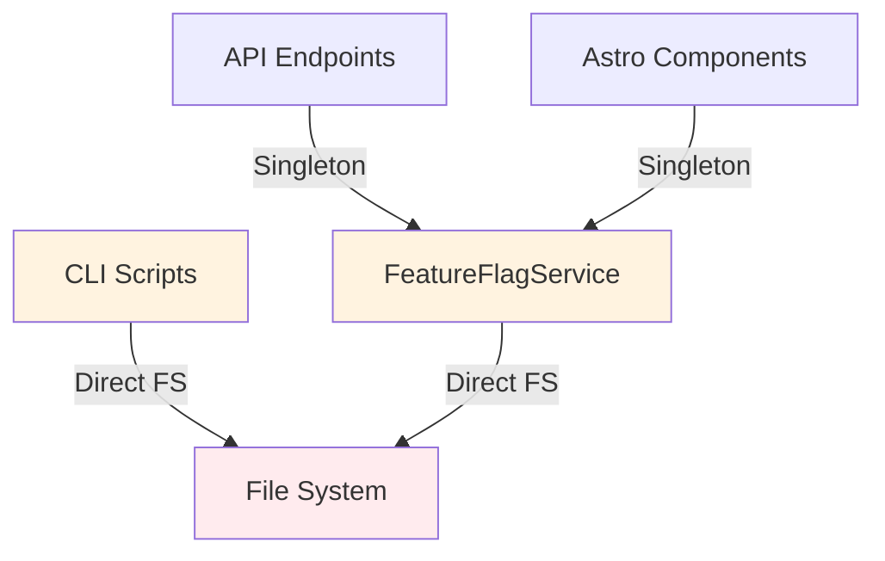
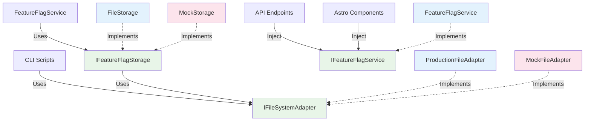
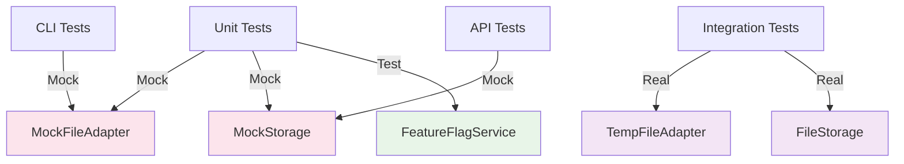

# Testable Feature Flags Refactoring

## Overview

Refactor the existing feature flag system to improve unit testability through dependency injection and interface-based design patterns. The current implementation has tight coupling to file system operations and singleton patterns that hinder comprehensive testing.

## Current Testability Issues

### Tight Coupling to File System
- `FeatureFlagService` directly imports and uses `fs.promises`
- CLI script performs direct file operations
- No abstraction layer for storage operations
- Hard to test error conditions and edge cases

### Singleton Pattern Limitations
- Static `getInstance()` method makes it difficult to create isolated test instances
- Shared state between tests can cause interference
- Cache clearing requires global state management

### Lack of Dependency Injection
- Services are hardcoded to use specific implementations
- No way to inject mock dependencies for testing
- Integration points are not easily mockable

## Requirements

### Core Interfaces
- `IFileSystemAdapter`: Abstract file operations (read/write/access)
- `IFeatureFlagService`: Abstract feature flag operations (get/set/list)
- `IFeatureFlagStorage`: Abstract storage layer with pluggable backends

### Improved Testability
- **Isolated Testing**: Each test can create its own service instance
- **Mock Dependencies**: File system operations can be mocked completely
- **Error Testing**: Simulate file system failures and edge cases
- **Performance Testing**: Mock timing and caching behaviors
- **Contract Testing**: Verify interface implementations maintain contracts

### Backward Compatibility
- **API Compatibility**: Existing service methods remain unchanged
- **Configuration**: Same configuration patterns and defaults
- **CLI Compatibility**: Scripts continue to work identically
- **Performance**: No degradation in production performance

## Architecture Diagrams

### Current Architecture (Tight Coupling)

### Proposed Architecture (Interface-Based)

### Test Architecture

## Success Criteria

### Testing Improvements
- **100% Unit Test Coverage**: All service methods tested in isolation
- **Error Path Testing**: File system failures, corrupt data, permission issues
- **Performance Testing**: Cache behavior, concurrent access patterns
- **Contract Testing**: Interface implementations maintain expected behavior

### Code Quality
- **No Breaking Changes**: Existing code continues to work unchanged
- **Clean Interfaces**: Clear separation of concerns and responsibilities
- **Type Safety**: Full TypeScript support with proper generics
- **Documentation**: Comprehensive interface documentation and examples

### Development Experience
- **Fast Tests**: Unit tests run without file system dependencies
- **Reliable Tests**: No flaky tests due to file system race conditions
- **Easy Mocking**: Simple mock creation for different test scenarios
- **Clear Error Messages**: Helpful error messages in test failures

This refactoring will transform the feature flag system from a tightly-coupled implementation to a loosely-coupled, interface-driven architecture that enables comprehensive testing while maintaining all existing functionality and performance characteristics.