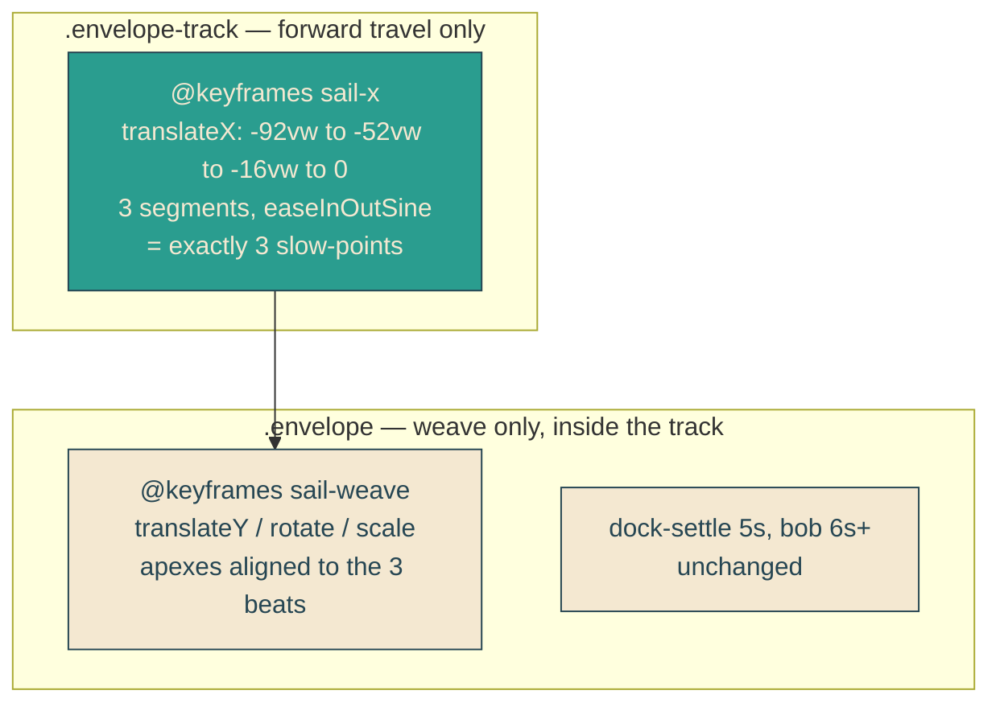

# three-beat-sail

## Verbatim request (2026-06-11)

> awesome. can the animation have only 3 pauses? and be smoother overall

## Confirmed understanding

The entrance currently eases through five keyframe segments, so forward motion
decelerates to a near-stop at every boundary — five felt hesitations. It becomes one
smooth voyage with exactly three felt slow-points: the down-tack turn, the up-tack
turn, and the final ease into the dock. Same 5-second schedule, word reveals and
everything downstream unchanged.

## How: split travel from weave

Because the two transforms live on separate elements, the side-to-side weave can
ease at its own rhythm without ever stalling forward progress — the standard
independent-axis technique for organic motion paths.

## Beat map

| Offset | Track (x) | Weave (y / rotate / scale) | Felt beat |
|---|---|---|---|
| 0% | -92vw | -14px / +2deg / 0.96 | enters high and far |
| 40% | -52vw | +22px / +3deg / 1.04 | beat 1: down-tack apex |
| 75% | -16vw | -10px / -2.5deg / 0.97 | beat 2: up-tack apex |
| 100% | 0 | 0 / 0 / 1 | beat 3: eases into dock |

## Plan

1. `heroScene.ts`: replace `SAIL_PATH` with `SAIL_TRACK` (4 x-waypoints = 3
   segments) and `SAIL_WEAVE` (4 y/rotate/scale waypoints), typed and exported.
2. Unit tests (failure-first): track has exactly 3 segments, strictly increasing
   offsets and x, enters offscreen and ends at rest; weave keeps the S invariants
   (two direction reversals, gentle bounds, lean follows tack, nearer-means-bigger);
   every weave offset aligns with a track offset.
3. Canary: parse both `@keyframes sail-x` and `@keyframes sail-weave` from yait.css
   against the specs, plus the easing declaration (easeInOutSine cubic-bezier) on
   both animations.
4. Markup: `HeroBay.astro` wraps the envelope in `.envelope-track`; the
   `data-testid="envelope"` moves to the track wrapper (it is the envelope's
   position); positioning rules move to the track; weave/settle/bob stay inner.
5. E2E updates: mid-bay clock-pinned displacement reads the track's transform; the
   tack-keyframes test finds sail-weave in the subtree. Compositor guard unchanged.
6. Validate locally (suites, deterministic frames, curl), deploy with sentinel =
   prod stylesheet containing the compiled 40 percent waypoint translate(-52vw),
   forensics pre/post.

### PR checklist pass

Path data stays in `heroScene.ts` beside the rest of the scene config; all rules in
yait.css (the wrapper adds no inline styles); nothing duplicated (sail keyframes
replaced, not forked); typed exported data testable without a browser; no comments;
unit + canary + integration + e2e cover the change.
