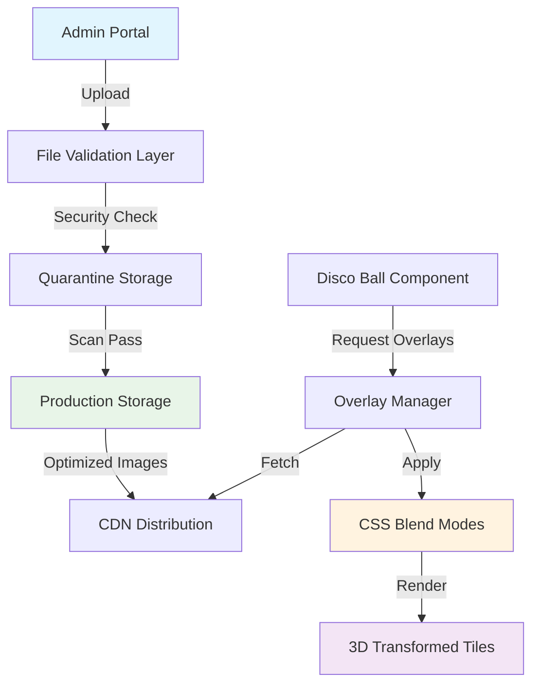
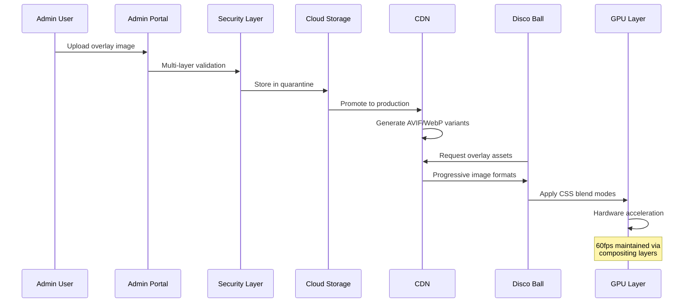
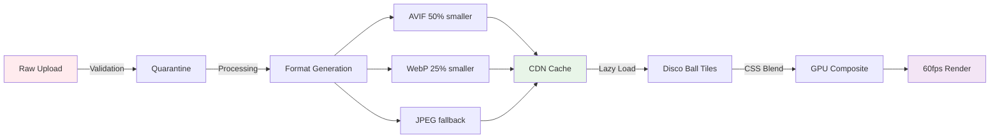

# Tile Overlay System Feature

## Understanding

Add a photo upload system to the admin portal where users can upload images that become "tile overlays" - visual effects applied to disco ball thumbnail tiles while maintaining 60fps performance through modern web optimization techniques.

## Research-Based Strategy

Based on 2026 web development research, this system will use:
- **Security-first upload architecture** with multi-layer validation
- **CSS blend modes** for hardware-accelerated overlay effects
- **Hybrid rendering** approach combining WebGL and CSS
- **Progressive image enhancement** (AVIF → WebP → JPEG)

## System Architecture

## Data Flow and Performance Strategy

## Performance Optimization Flow

## Technical Integration Points

### Security Architecture
1. **File Extension Allowlisting**: Only permit verified image formats
2. **Content Signature Verification**: Validate actual file types vs headers
3. **Segregated Storage**: Separate servers with indirect access mapping
4. **UUID Generation**: Randomized storage names for security

### Performance Integration
1. **CSS Blend Modes**: `multiply`, `overlay`, `soft-light` for effects
2. **Hardware Acceleration**: `will-change: transform` for compositing layers
3. **3D Transform Compatibility**: Proper z-index and perspective management
4. **Memory Management**: Cache limits with automatic cleanup

### Admin Interface Requirements
1. **Real-time Preview**: Live overlay effects on disco ball
2. **Drag & Drop Upload**: Modern file handling interface
3. **Effect Configuration**: Blend mode and opacity controls
4. **Mobile Responsive**: Touch-friendly admin controls

## Benefits

1. **Performance First**: GPU-accelerated effects maintain 60fps
2. **Security Focused**: Multi-layer validation prevents vulnerabilities
3. **Modern Web Standards**: AVIF/WebP support with fallbacks
4. **3D Compatible**: Works seamlessly with existing disco ball animations
5. **Scalable Architecture**: CDN distribution for global performance

## Success Metrics

- Upload processing < 2 seconds for images up to 5MB
- Overlay rendering maintains 60fps on mobile devices
- Admin interface achieves < 3 second time-to-comprehension
- Zero security incidents from file upload vulnerabilities
- 90%+ reduction in image file sizes vs raw uploads

## Technical Requirements

- Astro/Node.js backend for upload processing
- CSS blend mode support (baseline 2020+ browsers)
- WebGL fallback for complex overlay compositing
- Cloud storage integration (S3/Cloudflare)
- Admin authentication system
- Image optimization pipeline