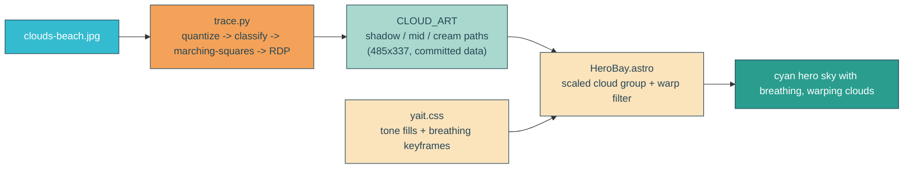
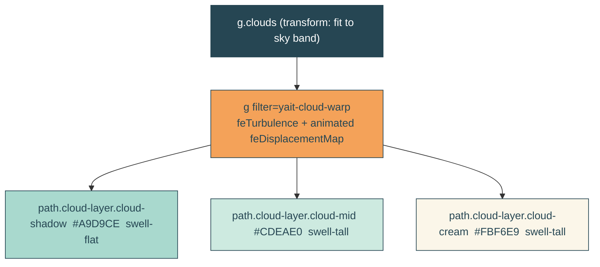

# traced-clouds

## Verbatim request (2026-06-14)

> this looks great. Can we add it to the site?

Referring to option C from the `/tmp/cloud-sample` exploration: pixel-traced clouds
(from `clouds-beach.jpg`) rendered as three stacked color layers, with an animated
displacement-warp on the edges and a gentle layered breathing.

## Confirmed decisions

- **Palette: keep the beach look.** The traced clouds stay seafoam / mid / cream, so
  the hero sky shifts from the amber sunset gradient to a cyan beach gradient. (Chosen
  over recoloring the clouds to sunset.)
- **Layout: match the sample.** Reproduce the traced arrangement (hero cumulus left,
  smaller clouds right and low) scaled across the upper sky band.

## What ships

1. The traced geometry becomes committed static data: three closed multi-subpath
   outlines (shadow / mid / cream) in a 485x337 coordinate space.
2. The hero scene renders those three layers, scaled/translated into the sky band,
   wrapped in an animated displacement-warp filter, with each layer breathing on its
   own slow phase.
3. The sky gradient becomes cyan to match the clouds.

## Motion (the approved option C feel)

- Edge warp: `feTurbulence` (fractalNoise) feeding `feDisplacementMap`, with the
  displacement `scale` and turbulence `baseFrequency` animated slowly so lobe edges
  undulate organically. Validated in the sample at ~4% changed pixels per cycle.
- Layered breathing: each tone layer scales subtly on its own phase from a low
  transform-origin (`swell-tall` for mid/cream, `swell-flat` for shadow). Tuned to the
  mid intensity the user approved (~6-7% combined changed pixels per cycle in the
  sample), down from the stronger pass.

## Reduced motion

`home.astro` already strips all `animate` / `animateTransform` on
`prefers-reduced-motion`, which freezes the warp. The CSS breathing is gated by the
existing reduced-motion block in `yait.css` (the cloud-layer selector is added there),
so the clouds rest fully static.

## Out of scope

The sun, sea, sand, gulls, dock, headline reveal, envelope, whip clip, and the
separate `index.astro` corner clouds. Per-sub-sphere (per-lobe) independent breathing
is deferred - this ships the whole-layer breathing the user approved.

## Validation

To validate traced-clouds I can rebuild and redeploy locally, CURL `/home` and grep
that the three `cloud-layer` paths, the `yait-cloud-warp` filter (with its animated
`feDisplacementMap`), and the new cyan sky stops are present (and the old amber stops
gone); confirm `/` still serves the RSVP form and `/api/health` is 200; then
screenshot the hero and compare the sky against the sample for the cream / mid /
seafoam banding and the cloud arrangement, and capture two frames to confirm the
clouds actually move. The unit test pins the CLOUD_ART contract, the canary pins the
keyframes / fills / reduced-motion (plus a new orphaned-keyframe guard), and the
integration test pins the served markup.
