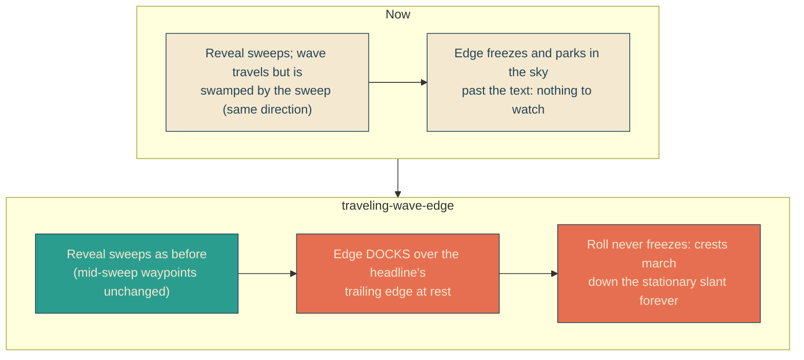
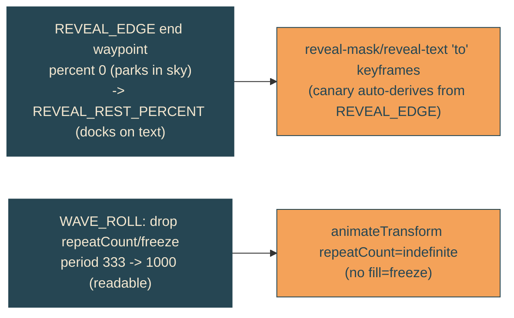

# traveling-wave-edge

## Verbatim request (2026-06-13)

> I think we have the wrong thing "waving". You know how there is a sine style wave
> transforming the edge of the reveal slants? it is that wave that should look like
> a sine wave in action where the sine wave is moving forward, so the waves are
> traveling down the slant

## What the investigation found

The roll built in [[perceptible-wave-roll]] and [[faster-wave-roll]] IS a correct
traveling wave (crests propagate one wavelength down the slant per period; measured
the edge region changing 900-1225 px across a cycle). But it never reads as one:

1. During the 6s reveal the wavy edge is also sweeping across the screen (the wipe).
   The crest travel runs in nearly the same direction as that sweep, so it is
   swamped - you read it as the whole edge sliding, not crests marching.
2. After the reveal the SMIL freezes and the edge parks past the last letter (the
   resting slant sits in the sky at x~1095-1280; the text ends at x~638 / ~897).
   So there is no stationary wavy edge left to watch the crests travel along.

There is no moment where you see a still slant with ripples running down it.

## Confirmed understanding (direction chosen: persistent wavy edge)

Leave a wavy edge resting at the headline after the reveal and keep the wave
traveling forever (no freeze). The headline ends up slightly clipped by the live
edge rather than a flat cut - accepted trade.

Mechanism, kept deliberately small and non-disruptive to the tuned boat-synced
reveal:

- Shift only the reveal's RESTING position so the wavy slant docks over the
  headline's trailing edge instead of parking in the sky. Only the final keyframe
  of the sweep changes; every mid-sweep waypoint (and the stern-locked tracking it
  drives) is untouched.
- Run the roll indefinitely (drop the freeze and the repeatCount derivation), at a
  readable one-wavelength-per-second period (revert the 333ms shimmer). On a now-
  stationary edge a readable speed reads as a traveling wave, not flicker.

## The ragged-right wrinkle (called out)

The headline is left-aligned and ragged: "You Are" ends near x638, "Invited To"
near x897. Both lines share one clip shape and one resting transform, so a single
resting edge can graze only one line's trailing edge. The plan rests it grazing the
longer line (line 2), which keeps content readable (only the tail of "To" is grazed
by crests); line 1's wave then sits in the sky just past "You Are". Per-line docking
is possible later but needs separate offsets and is out of scope here. To validate
the resting position I can screenshot the settled headline and adjust the rest
percent until the graze looks right.

## Before vs after

## Accessibility

Under prefers-reduced-motion the existing rule sets `animation: none` on the lines,
so they rest at the un-transformed state (translateX 0): text fully revealed, no
clip docking, no motion. The inline script still strips the SMIL node. Accessible
state is the clean full headline.

## Out of scope

- Per-line independent docking offsets.
- Reveal sweep trajectory / stern-locked tracking (untouched).
- Amplitude (stays 12.5px).
