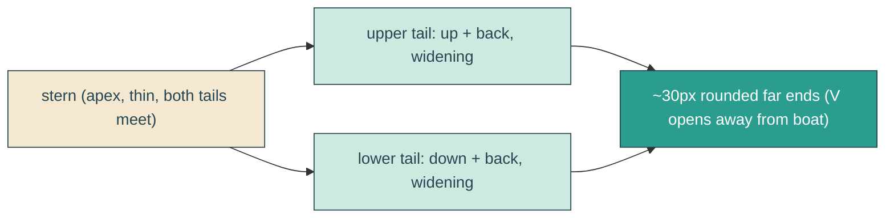

# twin-wake

## Verbatim request (2026-06-15)

> instead of having 1 tail represent both sides of the wake, can we have two tails that
> are still trapezoidal represent the left and right sides of the wake?
> [confirmed: splayed V (upper + lower), keep the subtle wiggle]

## Confirmed understanding

Replace the single tapered wake ribbon with two trapezoidal tails that fan out from the
boat's stern into a V - an upper tail angling up-and-back and a lower tail angling
down-and-back. Each stays trapezoidal (thin where it meets the boat, ~30px at the far
end) with the gentle wiggle, white 45%, riding the boat and settling at the dock.

## Mechanism

`buildWakeRibbon` becomes `buildWakeTails(g, phase)`, emitting one path with two closed
subpaths (upper + lower). Each tail's centerline starts at the stern (right, near the
vertical center) and splays away by `splay * (1 - x/width)` (upper = -, lower = +), plus
the sine wiggle; half-thickness still grows from `minHalf` (stern) to `maxHalf` (~30px
far end); semicircular caps at both ends. They converge at the stern (V apex) and open
toward the far end. `WAKE_GEOMETRY` gains `splay`; `height` grows to fit the V; the
`viewBox` and `.reveal-echo` box height grow to match. Rendering, fill, stern anchor, and
the morph animation are otherwise unchanged.

## Out of scope

The boat, headline, reveal clip, clouds. The wake stays white 45%, stern-pinned, rides
the sail, and wiggles; only its shape (one ribbon -> two splayed trapezoidal tails)
changes.

## Validation

To validate twin-wake I can unit-test `buildWakeTails` (two closed subpaths, four arc
caps, taper, deterministic, frame count); canary that the fill/anchor are unchanged;
integration that the path has two subpaths with arcs inside the envelope; e2e that the
wake renders as a taller V (bounding height grown) still pinned at the stern with no
scroll. Screenshot the hero mid-sail and confirm two trapezoidal tails fan out behind the
boat with rounded far ends; tune `splay`/`maxHalf`/anchor by screenshot.
