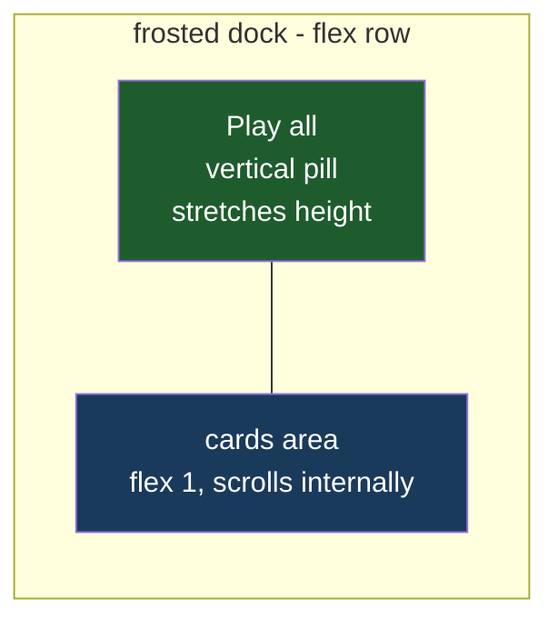

# Vertical Play All

## Understanding

The Play all button moves from centered above the cards to the left edge of the frosted
dock: a vertical pill spanning the dock's height with its text rotated 90 degrees (reading
bottom-to-top, spine-tab style). The cards flow to its right with their own internal
scrolling, so the button stays visible even when the guest area scrolls. Toggle behavior
and the running Stop state are unchanged.

## Layout approach

Rather than absolute positioning (which would scroll away inside the dock's scroll
container), the dock becomes a flex row: the button stretches to the dock height via
`align-self: stretch` with `writing-mode: vertical-rl` plus `rotate(180deg)` for upward
reading text; the card container takes `flex: 1` and carries the internal vertical scroll
that previously lived on the section.

## Outcome

- Vertical green pill (magenta while running) hugging the dock's left edge at all scroll
  positions; cards never run beneath it.
- E2E locks the geometry: button taller than wide, anchored at the dock's left, still
  toggling play/stop.
- Deployed to production once verified locally at desktop and mobile widths.
