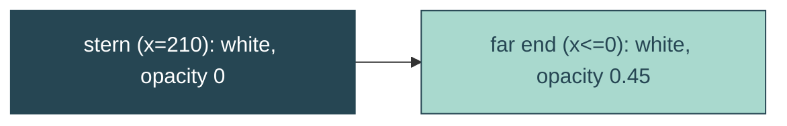

# wake-gradient

## Verbatim request (2026-06-15)

> can we have the wake have a linear gradient where it is opacity 0 closest to the boat
> and full at the end?
> [confirmed: full = the current 0.45 white]

## Confirmed understanding

Fill the wake tails with a horizontal linear gradient along their length: transparent
(opacity 0) at the boat/stern end, ramping to the wake's full translucency (0.45 white)
at the far (rounded) end. So the wake fades into existence behind the boat instead of
being uniform.

## Mechanism

- Add a `<linearGradient id="yait-wake-grad" gradientUnits="userSpaceOnUse">` inside the
  `.reveal-echo` svg, axis along x from the stern (`x=210`, the wake width) to the far end
  (`x=0`): stop `0` -> `stop-opacity 0`, stop `1` -> `stop-opacity 0.45` (white). Far x
  beyond `0` (the longer lower tail) clamps to the full stop.
- `yait.css`: `.reveal-echo-line` fill becomes `url(#yait-wake-grad)` (the flat
  `fill-opacity: 0.45` is removed - the opacity now lives in the gradient stops). The
  per-element `wake-fade` and `wake-pivot` animations are unchanged and still multiply on
  top.

## Out of scope

The wake shape, taper, splay, length, swivel, fade, stern pin, the boat. Only the wake's
fill changes from a flat translucent white to a transparent-to-0.45 gradient.

## Validation

To validate wake-gradient I can integration-assert the `yait-wake-grad` linearGradient
with `stop-opacity 0` and `0.45` stops inside the wake svg; canary that
`.reveal-echo-line` fill is `url(#yait-wake-grad)` (no flat fill-opacity); e2e that the
computed fill of the wake is a gradient url. Screenshot the wake and confirm it is
invisible at the boat and reaches full near the far end.
