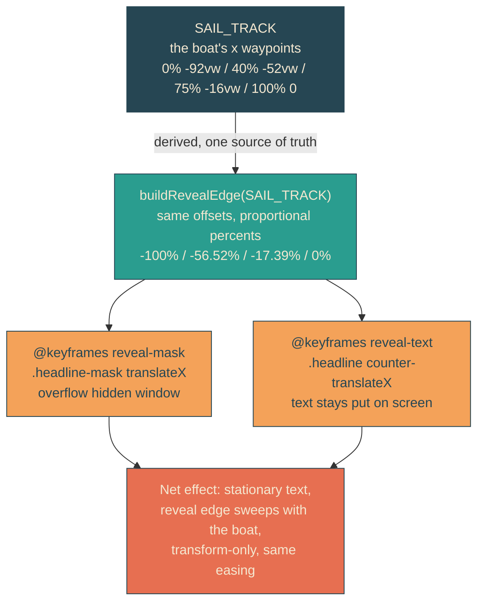

# wake-reveal

## Verbatim request (2026-06-11)

> awesome. can we figure out how to have the movement of the boat "reveal" the main
> text progressively?

## Confirmed understanding

The headline currently rises word by word on fixed timers that merely coincide with
the envelope's passage. Instead, the boat's movement itself reveals the text: the
words appear in the envelope's wake behind a clipping edge that sweeps left to right
in lockstep with the hull — slowing through each tack exactly as the boat does,
easing into completion as it docks. The per-word timers go away.

## How: a counter-transform wipe driven by the boat's own track

The mask and its inner text translate in opposite directions by identical magnitudes
on the same offsets and easeInOutSine curve as `sail-x`, so the window's edge moves
proportionally with the hull and the text never moves on screen — the standard
transform-only reveal, keeping the compositor guarantee.

## Plan

1. `heroScene.ts`: `buildRevealEdge(track)` mapping each track waypoint to a
   proportional mask percent (rounded to 2 decimals); export `REVEAL_EDGE`.
   `SCENE_TIMELINE` drops `wordRevealStartsMs` / `wordRevealDurationMs` (the timers
   this feature retires).
2. Unit tests (failure-first): REVEAL_EDGE endpoints (-100 to 0), offsets identical
   to SAIL_TRACK, strictly increasing, exact proportionality to track x. Timeline
   invariants updated for the slimmer SCENE_TIMELINE.
3. Canaries: yait-scene timeline equality updated; sail-keyframes canary gains
   reveal-mask / reveal-text blocks checked against REVEAL_EDGE (text negated) and
   the shared easing declaration on both.
4. Markup/CSS: headline wrapped in `.headline-mask` (overflow hidden, takes the old
   positioning); `.word` spans stay (tests and spacing) but word-inner and word-rise
   go; reduced-motion list covers the two new animated elements (default state =
   fully revealed).
5. E2E: clock-pinned at 2.0s the mask's computed translateX is proportional to the
   40 percent waypoint (about -56.5 percent of viewport); at 0 the headline is fully
   off-window. Existing docked/reduced-motion/compositor tests carry over.
6. Validate locally (suites, beat frames, curl markers unchanged), deploy with
   sentinel = compiled stylesheet containing "reveal-mask", forensics pre/post.

### PR checklist pass

Derivation lives beside the track data it derives from (`heroScene.ts`); all rules
in yait.css; no duplicated utilities or rules (word-rise is removed, not forked);
typed pure function testable without a browser; single purpose per function; no
comments; unit + canary + integration + e2e cover it.
