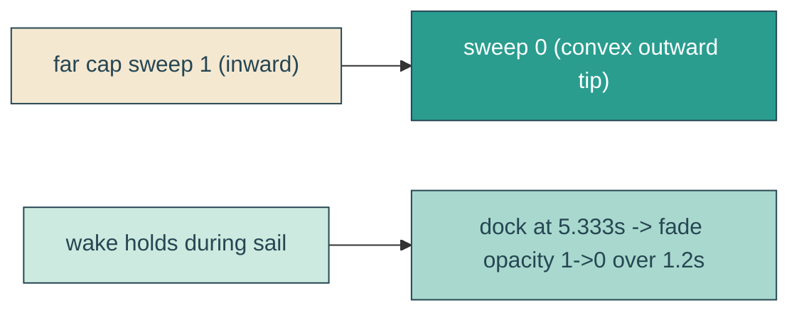

# wake-round-fade

## Verbatim request (2026-06-15)

> can we have the backs of these lines rounded outwards? and can we animate the opacity
> to fade after the boat parks?
> [confirmed: far ends convex outward; fade to 0 starting at dock, ~1.2s]

## Confirmed understanding

Two tweaks to the twin V-wake tails:
1. Round the back (far/wide) end of each tail so its cap bulges convex outward, away from
   the boat (a smooth rounded tail tip).
2. Fade the whole wake's opacity to 0 once the boat parks - hold during the sail-in, then
   fade starting at the dock moment (~5.333s) over ~1.2s, so a parked boat leaves no wake.

## Mechanism

- Far cap: in `wakeTail`, the far-end arc currently sweeps inward (`... 0 0 1 ...`); flip
  the sweep flag to `0` so the semicircular cap bulges outward (away from the boat). The
  small stern cap is unchanged.
- Fade: a CSS `wake-fade` keyframe (`opacity 1 -> 0`) on `.reveal-echo` with
  `animation-delay` = the dock time (`5.333s`), `1.2s`, `forwards`, so the wake stays
  visible through the sail and fades out after docking. The SMIL morph is unaffected.
  Under reduced motion the wake is hidden (`opacity: 0`), matching the docked scene.

## Out of scope

The taper, splay, wiggle, stern pin, fill colour, and the boat itself. Only the far-cap
sweep and the post-dock opacity fade change.

## Validation

To validate wake-round-fade I can unit-assert the far cap uses sweep `0` (outward) while
the path keeps two subpaths and four arcs; canary that `@keyframes wake-fade` exists, is
referenced by `.reveal-echo` with the dock delay, and that reduced motion hides the wake;
e2e that the wake's computed opacity is ~1 mid-sail and ~0 after docking. Screenshot the
hero and confirm the far ends bulge outward and the wake is gone once parked.
