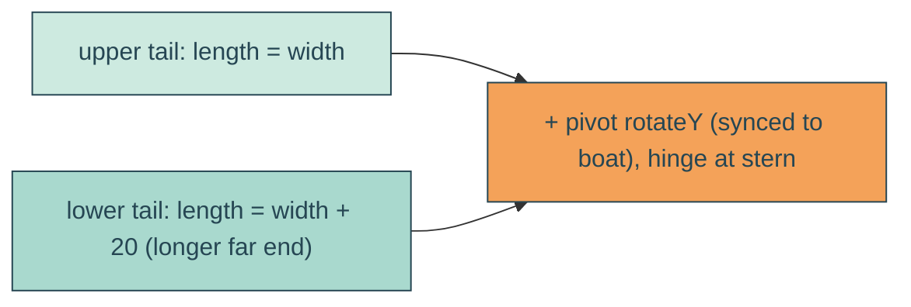

# wake-swivel

## Verbatim request (2026-06-15)

> can the bottom line be 20px longer than the top line? and can we have these lines turn
> on the y axis in sync with the boat?
> [confirmed: lower tail +20px at the far end; reuse the boat's pivot rotateY, hinged at
> the stern]

## Confirmed understanding

1. Make the lower wake tail 20px longer than the upper one - its far (rounded) end
   reaches 20px farther back; both still meet the boat at the stern.
2. Turn the whole wake on the Y axis in sync with the boat by reusing the envelope's
   `pivot` swivel (`perspective(600px) rotateY` 0->20->0->20->0 over the 4.444s sail),
   pivoting around the stern (where the wake meets the boat).

## Mechanism

- `WAKE_GEOMETRY` gains `bottomExtra: 20`. `wakeTail(g, phase, dir, length)` builds each
  tail over its own span (stern fixed at `x = width`, far end at `x = width - length`);
  upper `length = width`, lower `length = width + bottomExtra`. Taper, splay, and wiggle
  are normalized by the tail's own length so the lower tail is simply longer with the
  same ~30px rounded outward far end.
- `HeroBay.astro`: `wakeViewBox` widens left to include the longer lower tail and its cap
  (`minX = -(bottomExtra + maxHalf)`), and the `.reveal-echo` box width grows to match.
- `yait.css`: `.reveal-echo` adds the existing `pivot` animation (4.444s, same keyframes
  the envelope uses, so it is synced) alongside `wake-fade`, with
  `transform-origin: 100% 50%` so it hinges at the stern.

## Out of scope

The fade, taper amount, splay, stern pin, fill, the boat. Only the lower-tail length and
the synced Y-axis swivel are added.

## Validation

To validate wake-swivel I can unit-assert the lower tail extends past x=0 (a negative far
x) while the upper does not, keeping two subpaths / four caps / outward far caps; canary
that `.reveal-echo` runs the `pivot` animation with `transform-origin: 100% 50%`; e2e that
`.reveal-echo` has a running animation named `pivot` (same as the envelope, so synced).
Screenshot mid-beat and confirm the lower tail is longer and the wake swivels with the
boat.
