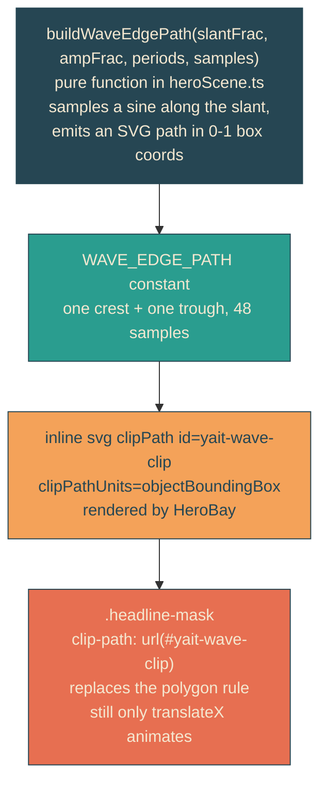

# wave-reveal-edge

## Verbatim request (2026-06-12)

> awesome. how hard would it be for us to make that slanted line have a wave to it
> where it looked like a sin wave with a crest or trough that was 50px above or
> below the slant?

## Confirmed understanding

Assessment first (verdict: moderate, architecture-compatible), then build: the
straight 45-degree reveal boundary becomes a sine wave along the slant — one crest
and one trough, each deviating 50px from the slant line at the 1280px reference
viewport, scaling proportionally elsewhere. Same stern lock, same timing,
transform-only animation.

## How: generated wave path in an objectBoundingBox clipPath

Why not stay in CSS: `polygon()` cannot curve and `path()` only accepts absolute
pixels, which breaks on fluid viewports. `objectBoundingBox` fractions scale with
the mask, keeping one path for all viewports; the 50px amplitude is derived from
the 1280x287 reference geometry (amplitude fraction of width ~0.039) and scales
proportionally with the page.

## Plan

1. `heroScene.ts`: `WAVE_REFERENCE = { viewportW: 1280, maskH: 287, slantPx: 285,
   amplitudePx: 50 }`; `buildWaveEdgePath(slantFracX, ampFracX, periods, samples)`
   returning the closed clip path string; `WAVE_EDGE_PATH` built from the
   reference (1 period, 48 samples).
2. Unit tests (failure-first): path opens at the box origin and closes; wave
   endpoints land exactly at the slant's top and bottom anchor points; parsed
   samples are monotonically descending in y; max deviation from the straight
   slant equals the amplitude fraction within tolerance, with both positive
   (crest) and negative (trough) deviations present.
3. Canaries: the CSS canary's polygon expectation becomes
   `clip-path: url(#yait-wave-clip)`; the scene canary locks that
   `WAVE_EDGE_PATH` round-trips through the reference constants.
4. Integration: served /home HTML contains the clipPath id and the exact opening
   of the generated path data.
5. E2E: rework the 45-degree test — computed clip-path is the url reference, and
   the slant ratio (slant fraction times rendered width over rendered height)
   stays in the 0.75-1.25 band; new amplitude assertion parses the rendered path's
   maximum deviation and converts to px (about 50 at the 1280 viewport, tolerance
   15). Compositor guard unchanged.
6. Validate locally (suites, mid-reveal frames showing the wavy boundary), deploy
   with sentinel = prod /home containing "yait-wave-clip", forensics pre/post.

### PR checklist pass

The generator lives beside the rest of the scene math in `heroScene.ts` (single
purpose, pure, typed); the clip reference is a style rule (no inline styles beyond
the established data-binding pattern); the polygon rule is replaced, not
duplicated; no comments; unit + canary + integration + e2e cover it.
