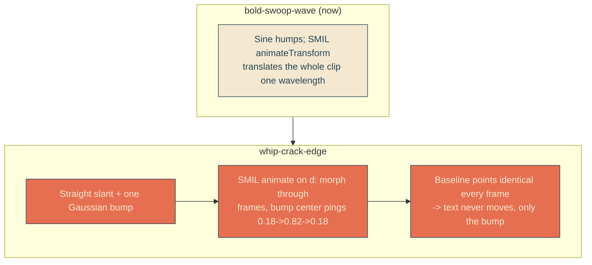
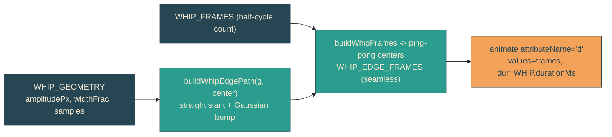

# whip-crack-edge

## Verbatim request (2026-06-13)

> lets try number 7!

(Variant 7 from the [[wave-gallery]]: a single bump races down the rope and bounces
back, like snapping a battle rope once.)

## Confirmed understanding

The headline reveal edge becomes a mostly-straight 45-degree slant carrying a single
travelling bump that runs down the slant, reflects at the far end, and runs back -
looping forever. The multi-hump sine waviness (bold-swoop-wave) is removed. It plays
during the reveal wipe and keeps cracking on the docked edge after the text lands.

## Why the mechanism must change (not a translate)

The bump travels the whole slant. We cannot move it by translating the clip shape
(as the sine roll did): a translate large enough to carry the bump end to end would
also drag the revealed text up and down by up to a full line height. So instead the
bump is moved by MORPHING the clip path's `d` between precomputed frames - the
straight baseline points are identical in every frame (so the revealed region and the
text never move) and only the bump's location changes. The travel + reflection is a
ping-pong sequence of frames, looped seamlessly (first frame == last).

## Carried over unchanged

- Docked rest position (`REVEAL_REST_PERCENT = -15`) and the reveal sweep / stern
  tracking from [[traveling-wave-edge]].
- Loops forever (the morph is `repeatCount="indefinite"`).
- Accessibility: the reduced-motion inline script removes the animation node; with the
  line animations also disabled, the headline rests fully revealed with a static
  straight-ish edge off the text. The script must now remove `animate` (the morph) as
  well as any `animateTransform`.

## Limits (validated honestly)

- Like before, the edge only shows where it crosses ink. During the reveal it rides
  the large dark unrevealed mass (very visible); at the docked rest it grazes the tail
  of "To" (subtler, partly behind the envelope). The bump cracking is most dramatic
  during the wipe. To validate whip-crack-edge I can capture the reveal sequence and
  confirm a single bump travels down and reflects, and that the text stays stable.
- Morphing `d` repaints the two clipped line layers per frame (same cost class as the
  prior per-frame roll).

## Out of scope

- Reveal trajectory, dock position, headline lockup: unchanged.
- The sine generator (`buildWaveEdgePath`, `WAVE_GEOMETRY`, `WAVE_ROLL`) is removed as
  dead code once the whip replaces it.
