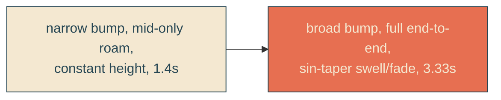
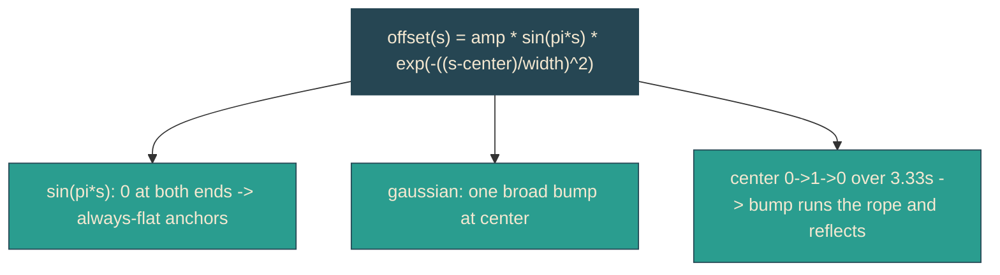

# whip-match-gallery

## Verbatim request (2026-06-13)

> can we make the line shape and movement feel exactly like #7?

## What diverged from gallery #7

When [[whip-crack-edge]] ported variant 7 onto the headline it changed four things
that make it feel different from the gallery sketch:

| aspect        | gallery #7                         | headline (before)      |
|---------------|------------------------------------|------------------------|
| bump width    | broad/soft, sigma ~0.167           | narrow/sharp, 0.09     |
| travel range  | full length, center 0 -> 1 -> 0     | middle only, 0.18-0.82 |
| envelope      | `sin(pi*p)` taper: swells mid-line, fades at ends | constant height |
| cadence       | ~3.33s full ping-pong              | 1.4s                   |

The gallery's `sin(pi*p)` rope anchor made the pulse grow as it reached mid-rope and
shrink into the anchored ends - the battle-rope quality. The headline lacked that.

## Confirmed understanding

Match all four so the shape and movement feel identical to #7, on the slant:

- `widthFrac` 0.09 -> 0.16667 (broad soft bump).
- travel `WHIP_CENTER_MIN/MAX` 0.18/0.82 -> 0/1 (full end-to-end, reflecting).
- add the `sin(pi*s)` taper to the bump offset so it swells mid-slant and fades to
  zero at the anchored ends (this also guarantees flat ends for any center, so the
  clip never exposes a corner).
- `WHIP_DURATION_MS` 1400 -> 3333 (the gallery's cadence).

Amplitude (34px) is unchanged - shape and movement were the ask, not size. Bump
frame count raised (`WHIP_HALF_FRAMES` 8 -> 12) so the longer end-to-end travel
morphs smoothly.

## Validation

To validate whip-match-gallery I can capture the reveal sequence and compare the
bump's breadth, end-to-end travel, mid-line swell, and cadence against the gallery
panel; the unit tests assert the new width/centers/taper/timing and that the ends
stay flat for every center.

## Out of scope

- Entrance timing (slower-entrance), docked rest position, amplitude, mechanism
  (still a `d` morph). Loops unchanged.
