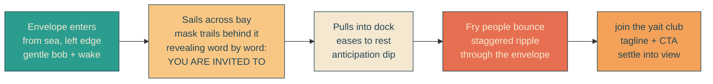
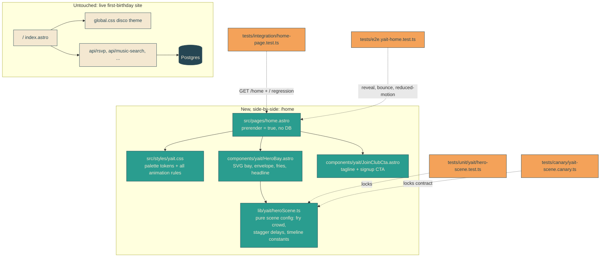

# yait-home-landing

## Verbatim request (2026-06-11)

> okay cool. I'm thinking this project will expand into something where users can fill out a form and sign up for bespoke RSVP party/event site development, of which the Alina disco one will be an example. For now we are using the site for my daughter's actual first birthday so we need to leave the existing work where it is, and iterate off to the side in this /home page. It should be enticing, demonstrating what user's can't get in the out-of-the-box solutions online today: highly performant animations, artful vibes, delightful touches, tasteful graphic design whimsy, and custom experiences. The theme of the brand comes from its name: "yait" which is short for "You are invited to" but will be pronounced "yacht", with a cheeky "join the yait club" tagline. the color scheme should feel warm and summary, and there should be a super high quality (like front page of dribble high quality) rendering of a coastline where a large envelope is pulling into the dock, and the envelope is stuffed with long, rounded corner people that are packed in like happy little french fries. The envelope should sail into the costal bay and the happy little people should then bounce up and down excitedly. As the Envelope sails across the page it slowly reveals the chunky graphic text of "You Are Invited To" (I'm talking a very chunky font). Before we dive in can you research for art examples with similar palletes and vibes that we can point to as agreed upon inspo? and draw up a md file capturing the verbatim request and your understanding of the request once confirmed?

## Confirmed understanding

### Strategic context

- yait is becoming a product: visitors fill out a form to sign up for bespoke RSVP
  party/event site development. The Alina disco invite (currently at `/`) becomes the
  flagship example of that service.
- The live site is in active use for a real first birthday. The existing `/` page and
  everything it depends on is untouchable; all new brand work iterates off to the side
  at the new `/home` route inside the same Astro app.

### Brand

- Name: **yait**, short for "You are invited to", pronounced "yacht".
- Tagline: **"join the yait club"** (cheeky, nautical).
- Positioning: what out-of-the-box invite/site builders cannot give you — highly
  performant animations, artful vibes, delightful touches, tasteful graphic design
  whimsy, custom experiences. The page itself is the proof.

### The hero scene

- Warm, summery color scheme.
- A Dribbble-front-page-quality rendering of a coastline with a dock on a coastal bay.
- A large envelope sails across the page like a boat and pulls into the dock.
- The envelope is stuffed with long, rounded-corner people packed in like happy little
  french fries.
- As the envelope sails across the page, it slowly reveals very chunky graphic display
  text: **"You Are Invited To"**.
- When the envelope docks, the little people bounce up and down excitedly.

### Agreed sequence of work

1. Research art examples with similar palettes and vibes; agree on inspo (this stage).
2. Mermaid diagrams telling the story at a glance, full implementation plan, PR-checklist
   pass, `yait-home-landing plan` commit.
3. TDD implementation, local rebuild and smoke tests, screenshot review,
   `yait-home-landing implementation` commit.
4. Deploy with cutover sentinel and deployment-forensics tracking.

## Diagrams

### The hero story at a glance

### Animation timeline (time-based, plays once on load)

```mermaid
gantt
    dateFormat s
    axisFormat %Ss
    section Envelope
    Sail across bay (translate)      :0, 5s
    Dock settle (anticipation dip)   :5, 1s
    Idle bob loop (infinite)         :6, 2s
    section Headline
    Word 1 You                       :1, 1s
    Word 2 Are                       :2, 1s
    Word 3 Invited                   :3, 1s
    Word 4 To                        :4, 1s
    section Fries
    Packed and still (tiny leans)    :0, 6s
    Excited bounce ripple            :6, 2s
    section Tagline and CTA
    Fade and rise in                 :6, 1s
```

### Architecture and isolation from the live birthday site

## Inspiration

Full research findings with all candidates and sources: [inspo.md](./inspo.md).

### Agreed shortlist (confirmed 2026-06-11)

- **Scene and palette:** neo-vintage riviera travel poster with grain texture —
  Bobby Evans' French Riviera poster for composition, Brian Edward Miller's "Harbor"
  for texture quality, Mads Berg for designing the envelope-as-vessel, Quentin Monge
  for restraint. Palette: peach-haze sky `#F9C784`, golden sun `#F4A259`, coral accent
  `#E76F51`, sea teal `#2A9D8F`, deep ink `#264653`, sand cream `#F4E8D1` (roughly
  60/25/10/5 warms/teal/ink/coral).
- **Fry people:** Duolingo's rounded-rectangle shape language for construction,
  Headspace (BUCK / Nexus) for one-shape-family crowds, Animade's Facebook Reactions
  for bounce quality, Mana's "The crowd goes wild" for staggered group timing.
- **Headline type: Shrikhand** (Google Fonts, OFL) — ultra-fat display italic whose
  forward lean echoes the envelope's sailing motion. Runners-up recorded in inspo.md:
  Titan One, Chunk.
- **Technique:** hand-built SVG scene, compositor-only transforms, mask reveal moved
  by transform, staggered shared keyframes for the crowd, prefers-reduced-motion
  fallback (scene pre-docked, headline revealed).
