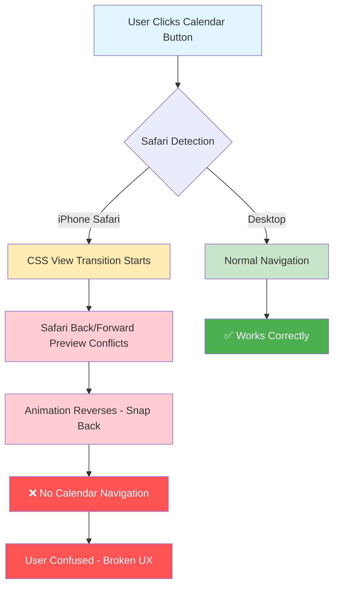
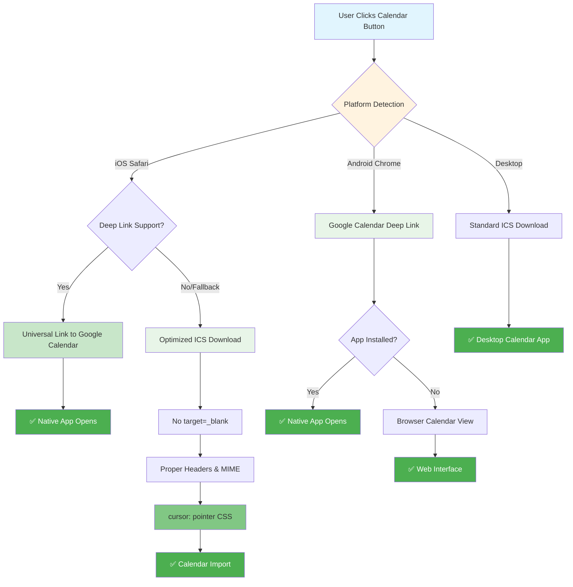
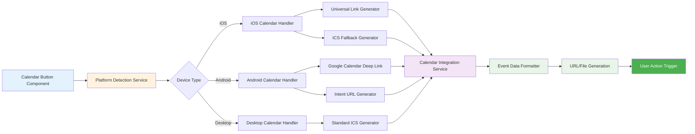
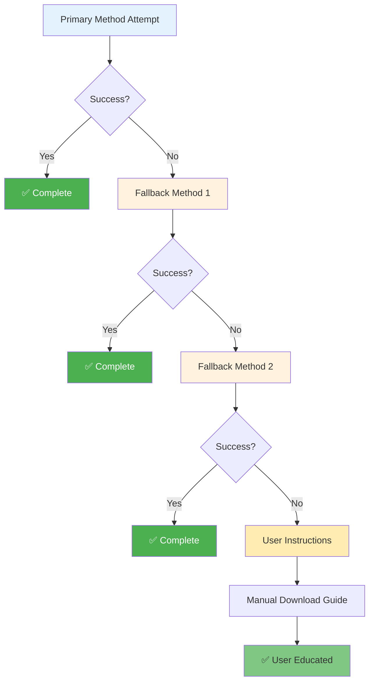

# Mobile Calendar Fix - Flow Diagrams

## Current Broken Flow (Safari)

```mermaid
graph TD
    A[User Clicks Calendar Button] --> B{Safari Detection}
    B -->|iPhone Safari| C[CSS View Transition Starts]
    C --> D[Safari Back/Forward Preview Conflicts]
    D --> E[Animation Reverses - Snap Back]
    E --> F[❌ No Calendar Navigation]
    F --> G[User Confused - Broken UX]
    
    B -->|Desktop| H[Normal Navigation]
    H --> I[✅ Works Correctly]
    
    style A fill:#e1f5fe
    style C fill:#ffecb3
    style D fill:#ffcdd2
    style E fill:#ffcdd2
    style F fill:#ff5252,color:#fff
    style G fill:#ff5252,color:#fff
    style H fill:#c8e6c9
    style I fill:#4caf50,color:#fff
```

## Proposed Fixed Flow - Hybrid Approach

```mermaid
graph TD
    A[User Clicks Calendar Button] --> B{Platform Detection}
    
    B -->|iOS Safari| C{Deep Link Support?}
    C -->|Yes| D[Universal Link to Google Calendar]
    D --> E[✅ Native App Opens]
    
    C -->|No/Fallback| F[Optimized ICS Download]
    F --> G[No target=_blank]
    G --> H[Proper Headers & MIME]
    H --> I[cursor: pointer CSS]
    I --> J[✅ Calendar Import]
    
    B -->|Android Chrome| K[Google Calendar Deep Link]
    K --> L{App Installed?}
    L -->|Yes| M[✅ Native App Opens]
    L -->|No| N[Browser Calendar View]
    N --> O[✅ Web Interface]
    
    B -->|Desktop| P[Standard ICS Download]
    P --> Q[✅ Desktop Calendar App]
    
    style A fill:#e1f5fe
    style B fill:#fff3e0
    style D fill:#c8e6c9
    style E fill:#4caf50,color:#fff
    style F fill:#e8f5e8
    style I fill:#81c784
    style J fill:#4caf50,color:#fff
    style K fill:#e8f5e8
    style M fill:#4caf50,color:#fff
    style O fill:#4caf50,color:#fff
    style Q fill:#4caf50,color:#fff
```

## Technical Implementation Architecture

```mermaid
graph LR
    A[Calendar Button Component] --> B[Platform Detection Service]
    B --> C{Device Type}
    
    C -->|iOS| D[iOS Calendar Handler]
    D --> E[Universal Link Generator]
    D --> F[ICS Fallback Generator]
    
    C -->|Android| G[Android Calendar Handler]
    G --> H[Google Calendar Deep Link]
    G --> I[Intent URL Generator]
    
    C -->|Desktop| J[Desktop Calendar Handler]
    J --> K[Standard ICS Generator]
    
    E --> L[Calendar Integration Service]
    F --> L
    H --> L
    I --> L
    K --> L
    
    L --> M[Event Data Formatter]
    M --> N[URL/File Generation]
    N --> O[User Action Trigger]
    
    style A fill:#e3f2fd
    style B fill:#fff3e0
    style L fill:#f3e5f5
    style M fill:#e8f5e8
    style N fill:#e8f5e8
    style O fill:#4caf50,color:#fff
```

## Error Handling & Fallback Chain

```mermaid
graph TD
    A[Primary Method Attempt] --> B{Success?}
    B -->|Yes| C[✅ Complete]
    B -->|No| D[Fallback Method 1]
    
    D --> E{Success?}
    E -->|Yes| F[✅ Complete]
    E -->|No| G[Fallback Method 2]
    
    G --> H{Success?}
    H -->|Yes| I[✅ Complete]
    H -->|No| J[User Instructions]
    
    J --> K[Manual Download Guide]
    K --> L[✅ User Educated]
    
    style A fill:#e3f2fd
    style C fill:#4caf50,color:#fff
    style D fill:#fff3e0
    style F fill:#4caf50,color:#fff
    style G fill:#fff3e0
    style I fill:#4caf50,color:#fff
    style J fill:#ffecb3
    style L fill:#81c784
```