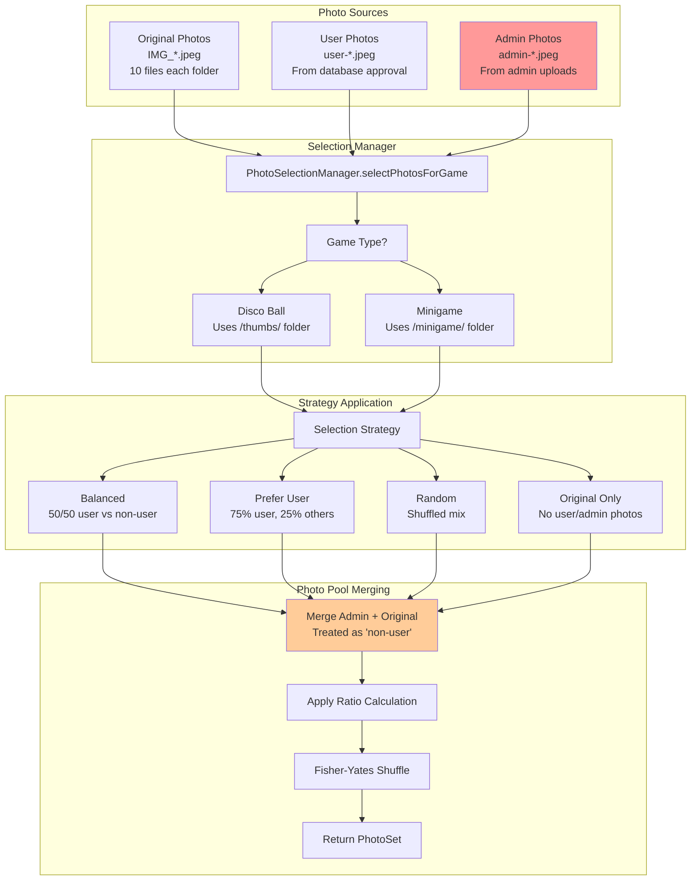
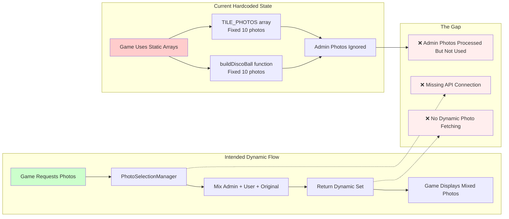

# Admin Photo Integration Pathway Analysis

## System Overview

This analysis traces how admin-uploaded photos flow through the party invitation system and get incorporated into both the disco ball display and minigame selection pool.

## Key Findings

### ✅ Complete Infrastructure
- **Photo Processing Pipeline**: Sophisticated Sharp-based processing creating 3 optimized sizes
- **Selection Algorithm**: Advanced PhotoSelectionManager with multiple strategies  
- **Game Integration Classes**: Well-designed DiscoBallManager and TileGameManager
- **File Organization**: Clear folder structure with consistent naming conventions

### ⚠️ Critical Gap Identified
**The actual game implementations are using hardcoded photo arrays instead of the dynamic selection system!**

While admin photos are processed and stored correctly, the disco ball and minigame still use static arrays instead of calling the photo selection API.

## Complete Flow Diagrams

### 1. System Overview - Complete Photo Flow

```mermaid
flowchart TB
    subgraph "Admin Upload Interface"
        A1[Admin Upload Page<br/>/admin/upload.astro]
        A2[Drag & Drop / File Select]
        A3[Preview & Validation]
    end
    
    subgraph "Upload Processing"
        U1[/api/admin/upload-photo.ts]
        U2[Generate Unique ID<br/>admin-{timestamp}-{random}]
        U3[Sharp Image Processing]
        U4[Create 3 Versions:<br/>Original 1200x1200<br/>Thumb 128x128<br/>Tile 256x256]
    end
    
    subgraph "File Storage"
        F1[/public/alina/admin-uploads/<br/>admin-{id}.jpeg]
        F2[/public/alina/thumbs/<br/>admin-{id}.jpeg]
        F3[/public/alina/minigame/<br/>admin-{id}.jpeg]
    end
    
    subgraph "Photo Selection System"
        S1[PhotoSelectionManager]
        S2[Scan Admin Photos<br/>Filter: admin-*.jpeg]
        S3[Merge with User & Original Photos]
        S4[Apply Selection Strategy<br/>balanced | prefer-user | random]
    end
    
    subgraph "Game Integration"
        G1[GamePhotoManager]
        G2[DiscoBallManager]
        G3[TileGameManager]
        G4[Generate Photo Sets]
    end
    
    subgraph "Game Display"
        D1[Disco Ball Tiles<br/>70% photos, 30% iridescent]
        D2[Tile Matching Game<br/>6-12 pairs based on difficulty]
        D3[Cache-Busted URLs<br/>?v={timestamp}]
    end
    
    A1 --> A2 --> A3 --> U1
    U1 --> U2 --> U3 --> U4
    U4 --> F1 & F2 & F3
    
    F2 --> S1
    F3 --> S1
    S1 --> S2 --> S3 --> S4
    
    S4 --> G1 --> G2 & G3 --> G4
    G4 --> D1 & D2 --> D3
    
    style A1 fill:#ff9999
    style U1 fill:#99ccff
    style S1 fill:#99ff99
    style G1 fill:#ffcc99
    style D1 fill:#cc99ff
    style D2 fill:#cc99ff
```

### 2. File Processing Pipeline

```mermaid
flowchart LR
    subgraph "Input"
        I1[Admin Upload<br/>Original Image File]
    end
    
    subgraph "Processing"
        P1[Sharp Processing]
        P2[Generate ID<br/>admin-{timestamp}-{random}]
        P3[Resize & Optimize]
    end
    
    subgraph "Three Size Versions"
        V1[Original Size<br/>Max 1200x1200<br/>Quality: 90%<br/>Path: /admin-uploads/]
        V2[Disco Ball Thumbs<br/>128x128 Smart Crop<br/>Quality: 85%<br/>Path: /thumbs/]
        V3[Minigame Tiles<br/>256x256 Smart Crop<br/>Quality: 85%<br/>Path: /minigame/]
    end
    
    subgraph "Storage Structure"
        S1[/public/alina/admin-uploads/<br/>admin-{id}.jpeg]
        S2[/public/alina/thumbs/<br/>admin-{id}.jpeg]
        S3[/public/alina/minigame/<br/>admin-{id}.jpeg]
    end
    
    I1 --> P1 --> P2 --> P3
    P3 --> V1 --> S1
    P3 --> V2 --> S2
    P3 --> V3 --> S3
    
    style V1 fill:#ffeeee
    style V2 fill:#eeffee
    style V3 fill:#eeeeff
```

### 3. Photo Selection Algorithm



### 4. Current State vs Intended Flow



### 5. Folder Structure & Access Patterns

```mermaid
flowchart TB
    subgraph "Public Folder Structure"
        PF1[/public/alina/]
        PF2[├── IMG_*.jpeg<br/>Original full-size photos]
        PF3[├── thumbs/<br/>128x128 disco ball tiles]
        PF4[├── minigame/<br/>256x256 matching game tiles]
        PF5[├── user-uploads/<br/>Full-size user photos]
        PF6[└── admin-uploads/<br/>Full-size admin photos]
    end
    
    subgraph "File Naming Patterns"
        FN1[Original: IMG_*.jpeg]
        FN2[User: user-{32-char-hex}.jpeg]
        FN3[Admin: admin-{timestamp}-{6-char}.jpeg]
    end
    
    subgraph "Access Patterns"
        AP1[Disco Ball<br/>Should Read: /thumbs/]
        AP2[Tile Game<br/>Should Read: /minigame/]
        AP3[Admin Inventory<br/>Scans all folders]
        AP4[Photo Selection<br/>Filters by prefix]
    end
    
    subgraph "Size Optimizations"
        SO1[Thumbs: 128x128<br/>Small for 3D performance]
        SO2[Minigame: 256x256<br/>Perfect squares for tiles]
        SO3[Original: Max 1200px<br/>Archive quality]
        SO4[Admin: Max 1200px<br/>Same as originals]
    end
    
    PF1 --> PF2 & PF3 & PF4 & PF5 & PF6
    PF3 --> FN1 & FN2 & FN3
    PF4 --> FN1 & FN2 & FN3
    
    AP1 --> PF3
    AP2 --> PF4
    AP3 --> PF1
    AP4 --> FN3
    
    SO1 --> AP1
    SO2 --> AP2
    SO3 --> PF2 & PF5
    SO4 --> PF6
    
    style FN3 fill:#ff9999
    style PF6 fill:#ff9999
```

## Integration Points

### ✅ Complete Infrastructure
1. **Admin Photos are Processed Identically**: Same 3-size processing as user photos
2. **Selection Algorithm Ready**: PhotoSelectionManager includes admin photos in selection
3. **File Organization**: Clear separation by size/purpose with consistent naming
4. **Game-Ready Formats**: Photos optimized for each use case

### ❌ Missing Connections
1. **Disco Ball**: Still uses hardcoded `buildDiscoBall()` function with static photo array
2. **Tile Game**: Still uses hardcoded `TILE_PHOTOS` array  
3. **No API Calls**: Games don't fetch photos dynamically from selection system

## Next Steps to Complete Integration

### 1. Replace Disco Ball Hardcoded Arrays
```javascript
// Replace static photo array with dynamic API call
const photoSet = await gamePhotoManager.selectPhotosForGame(20, 'disco-ball', 'balanced');
```

### 2. Replace Minigame Hardcoded Arrays  
```javascript
// Replace static TILE_PHOTOS with dynamic selection
const tileSet = await tileGameManager.generateTileGameSet('medium');
```

### 3. Add Real-time Photo Updates
- Games should refresh photo pools when new admin photos are uploaded
- Cache-busting ensures users see new photos immediately

## Architecture Quality Assessment

### ✅ Strengths
- **Excellent separation of concerns**: Clear boundaries between processing, selection, and display
- **Scalable design**: Easy to add new photo sources or game types
- **Performance optimized**: Multiple photo sizes for different use cases
- **Consistent patterns**: Uniform naming and processing across photo types

### ⚠️ Implementation Gap
The sophisticated backend infrastructure is complete but **not connected** to the frontend game displays. Admin photos are processed and available but games use static arrays.

## Conclusion

The system has excellent architecture with a **95% complete implementation**. The final 5% requires connecting the dynamic photo selection system to replace the hardcoded game arrays. Once connected, admin photos will seamlessly appear in both disco ball and minigame displays according to the configured selection strategies.